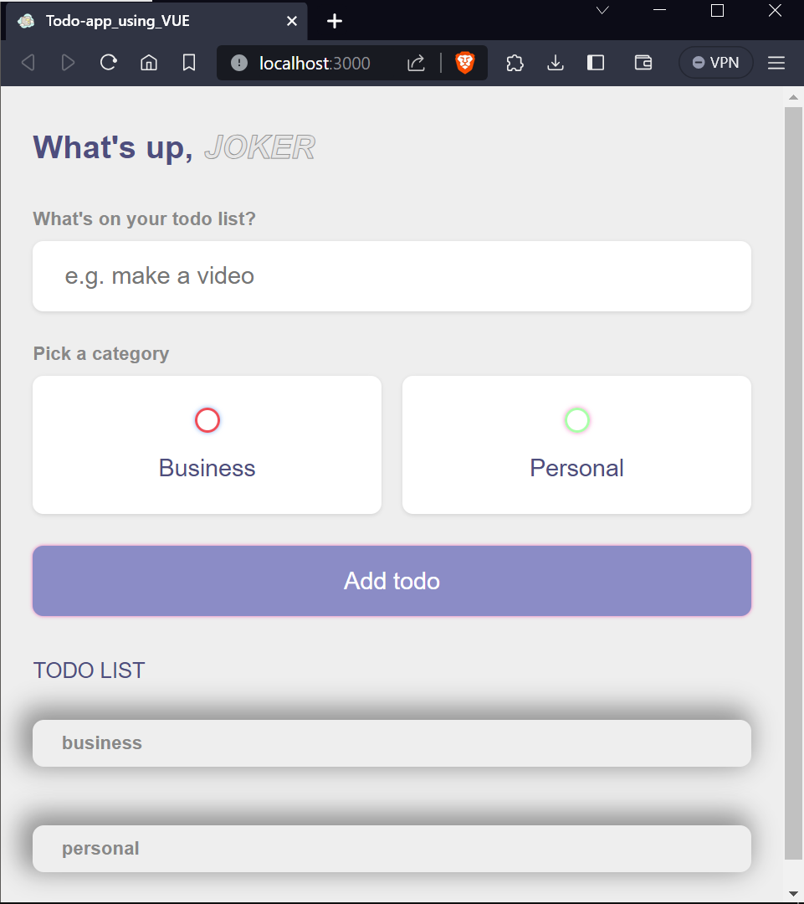
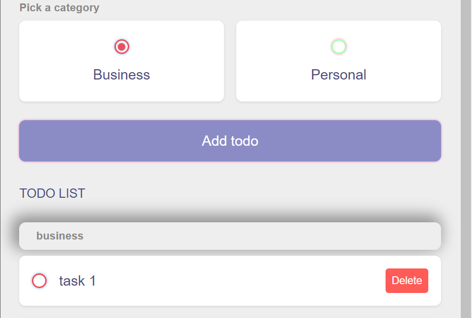
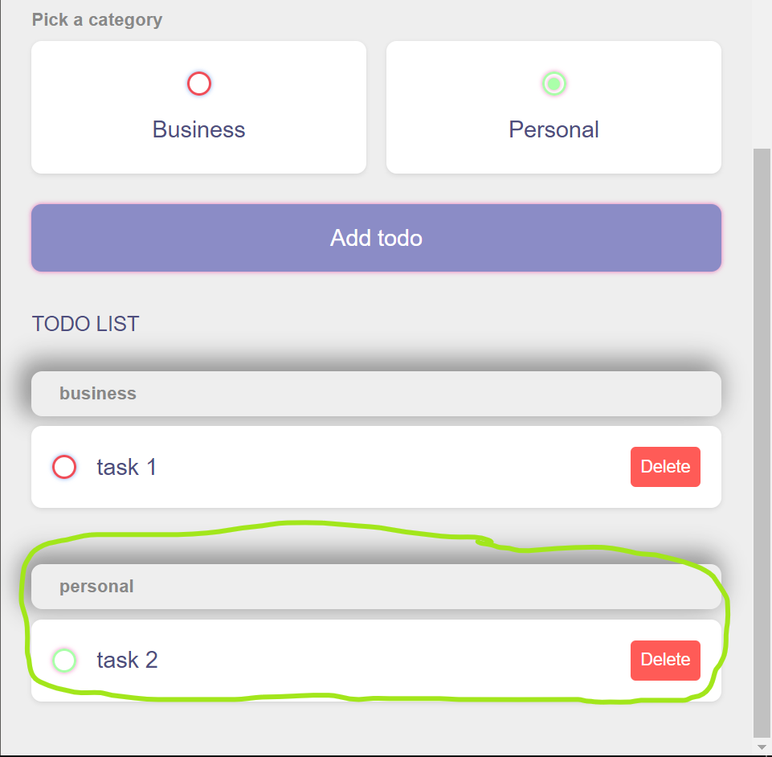

# To-Do List using Vue.js 



## Description

This is a simple and user-friendly to-do list web application built with Vue.js. It allows users to create, organize, and manage their tasks with ease. The application features personalized greetings and category-based task organization.

## Features

- Create, edit, and delete tasks.
- Categorize tasks as "Business" or "Personal."
- Personalized greeting with the user's name.
- Dark mode for comfortable night-time usage.
- Data persistence using local storage.
- User-friendly and intuitive interface.

## Installation

1. Clone the repository:

   ```bash
   git clone https://github.com/prateek271/vuejs-todo-list.git
   ```

2. Navigate to the project directory:

   ```bash
   cd vuejs-todo-list
   ```

3. Open the `index.html` file in your web browser.

## Usage

- To create a task, enter a task description and select a category.
- Check the "Edit" box to make changes to an existing task.
- Click the category bubbles to switch between "Business" and "Personal" tasks.
- Tasks can be marked as done or undone with the checkbox.
- Use the "Delete" button to remove a task from the list.

## Screenshots





## Credits

- Built with Vue.js - [Vue.js Official Website](https://vuejs.org/)
- Styling with CSS

## License

This project is open-source and available under the [MIT License](./LICENSE).
